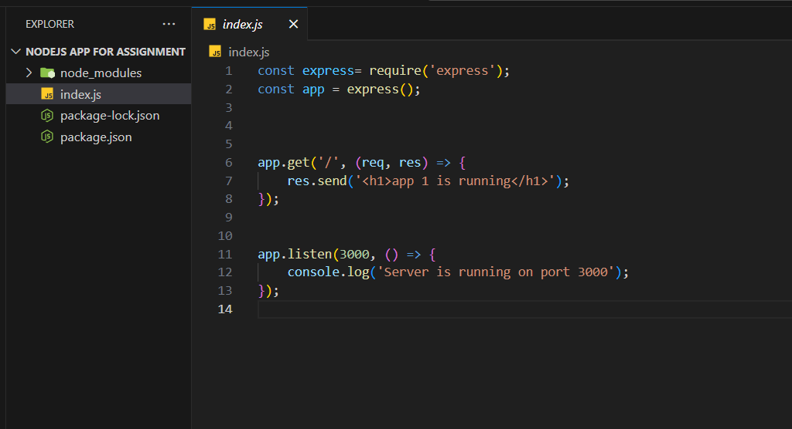
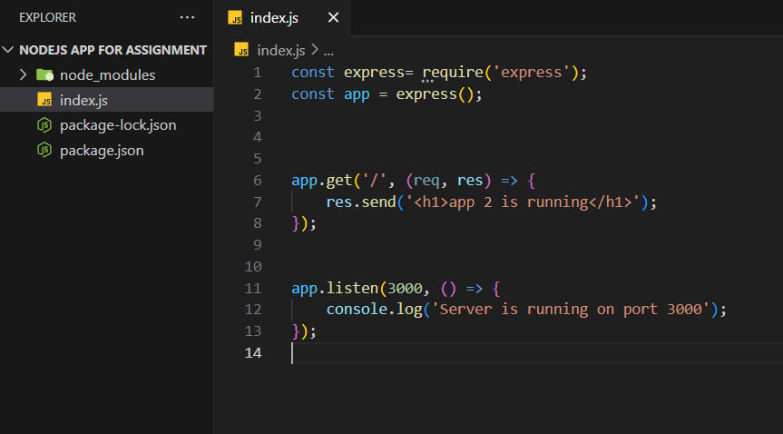
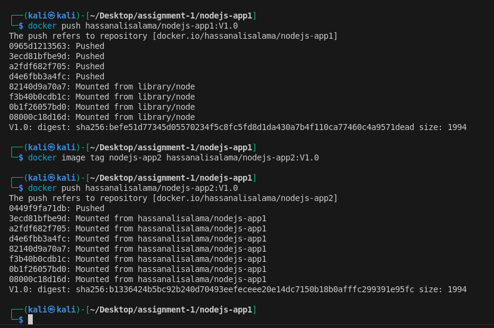
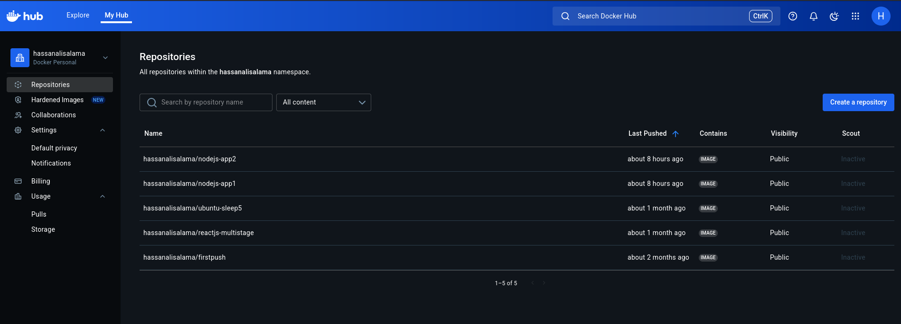
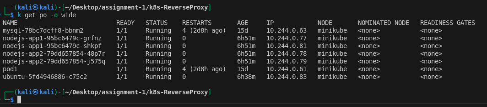
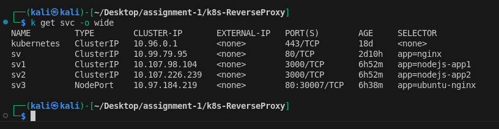
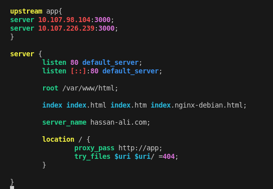
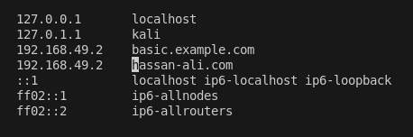
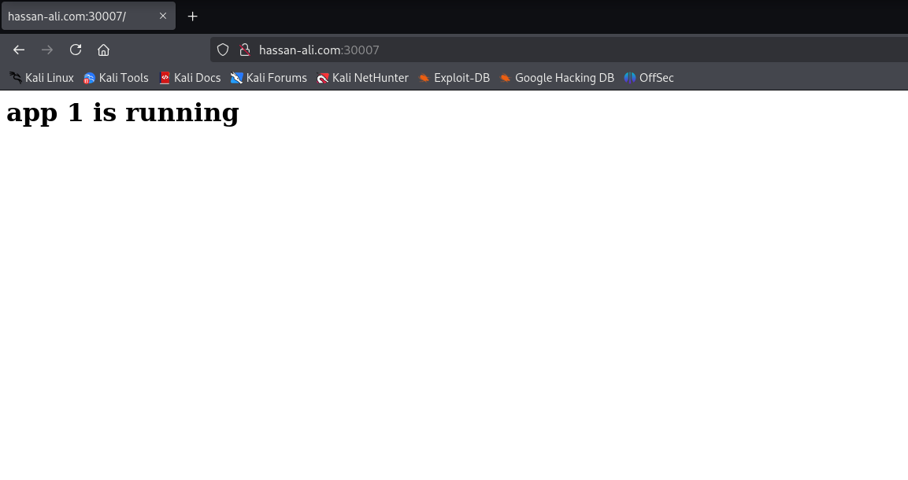
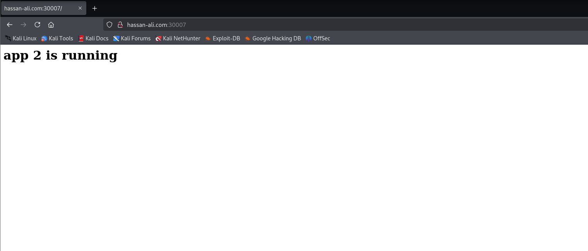

# Kubernetes Reverse Proxy & Load Balancing Project

A practical project to practice working with Docker, Nginx, and Kubernetes together.

## Project Idea

The idea of the project is to Dockerize two separate Node.js applications, deploy them in a Kubernetes (Minikube) cluster, and place an Nginx instance (inside an Ubuntu-based Pod) in front of them to act as a reverse proxy and simple load balancer.

---

## Steps

### 1. Create Two Simple Node.js Applications
I created two simple Node.js applications, and each one shows a different message in the browser so I can distinguish between them.  
  

### 2. Dockerize and Push to Docker Hub
I created Docker images for both applications and pushed them to Docker Hub.  
  

### 3. Create Deployments With Replicas
I created a Deployment for each application and set 2 replicas for each to provide redundancy and distribute load.

### 4. Create ClusterIP Services
I created a Service of type ClusterIP for each application so they can communicate internally, and so that even if a Pod IP changes, access remains stable through the Service.

### 5. Create an Ubuntu Deployment and a NodePort Service
I created another Deployment with 1 replica using an Ubuntu image to keep a Pod running, and I created a Service of type NodePort to expose Nginx externally so I can access the system from outside the cluster.  
  

### 6. Install Nginx Inside the Ubuntu Pod and Configure Reverse Proxy
I entered the Ubuntu Pod, installed Nginx manually, and configured it as a reverse proxy using a custom domain name.  

### 7. Map the Domain Locally
On my local machine, I added an entry in the hosts file (/etc/hosts) to map the domain to the Minikube IP so I can access the system using the domain name.  

### 8. Test: First Access Shows App 1
I accessed the domain in the browser and it showed the first application (App 1).  

### 9. Refresh: Shows App 2
After refreshing the page, the response changed and it showed the second application (App 2), confirming that load balancing (round-robin) is working through the reverse proxy.  

---

## Summary

Two different Node.js applications were containerized, deployed with multiple replicas, exposed internally via ClusterIP Services, and fronted by Nginx acting as a reverse proxy inside an Ubuntu Pod. A NodePort Service exposed Nginx externally, a local domain was mapped to the Minikube IP, and refreshing verified that requests were distributed between the two applications.

---
